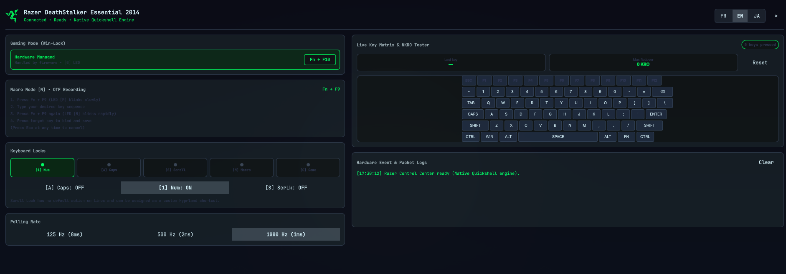
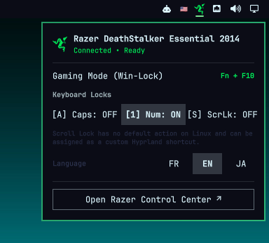

# 🐍 Razer Control for Omarchy Linux

An **ultra-lightweight, zero-bloat, native hardware controller and diagnostic center** for Razer keyboards on Omarchy Linux (Hyprland / Quickshell).



---

## 🎯 Purpose & Philosophy

Linux users often face a dilemma when using Razer peripherals: either install heavy, multi-layered daemon suites (like OpenRazer + Polychromatic / RazerGenie with multiple background D-Bus services and Python runtimes) or have no control over their hardware. Furthermore, many older or legacy keyboards (such as the DeathStalker 2014 series) are only partially supported or require heavy workarounds.

**Razer Control** solves this problem by providing:
- **Zero background daemons**: Direct communication with Razer hardware via standard Linux `/dev/hidraw*` device nodes.
- **100% Native Quickshell & C++ Qt Quick**: Silky-smooth rendering matching your monitor's refresh rate (60/144/240Hz) with **0 MB Chromium / Web browser memory overhead**.
- **Self-contained**: Both the status bar widget and the full Control Center window are bundled in a single lightweight plugin package.
- **Legacy & Modern Keyboard Support**: Full support for classic and modern Razer keyboards alike.

---

## ✨ Features

### 1. 📊 Interactive Bar Widget
- **Live Status & Indicator**: Real-time indicator for active device connection and Gaming Mode status.
- **Quick Flyout Controls**: Direct access to brightness sliders, lighting modes, lock modifiers, and language selection.
- **Instant Launcher**: Right-click the bar icon or click **`Open Razer Control Center ↗`** to open the full standalone control panel.



### 2. 🎛️ Full Native Control Center
- **Backlight & Lighting Effects**: Real-time brightness adjustment and effect toggling (*Static*, *Breathing*, *Off*). Automatically adapts and hides sliders for non-backlit models.
- **Hardware Gaming Mode (Win-Lock)**: Status indicator for autonomous hardware Windows-key locking (<kbd>Fn</kbd> + <kbd>F10</kbd>).
- **On-The-Fly (OTF) Macro Guide**: Interactive step-by-step tutorial for hardware macro recording (<kbd>Fn</kbd> + <kbd>F9</kbd>) without third-party software.
- **5-LED Hardware HUD & Modifiers**: Live indicators for `[1] Num`, `[A] Caps`, `[S] Scroll`, `[M] Macro`, and `[G] Game`, plus direct hardware modifier toggling buttons.
- **Scroll Lock Customization Note**: Explains modern Linux / Wayland Scroll Lock behavior and how to map it to custom Hyprland shortcuts (screenshots, microphone mute, window toggles).
- **Polling Rate Switcher**: Instant switching between 125 Hz (8ms), 500 Hz (2ms), and 1000 Hz (1ms).
- **Live Key Rollover (NKRO) & Anti-Ghosting Tester**: Interactive visual keyboard map that illuminates pressed keys, tracks simultaneous keystrokes, and calculates Max Rollover.
- **Packet & Event Console**: Live monitor showing system events and low-level 90-byte Razer hardware frames.

### 3. 🌐 Tri-Lingual Localization (i18n)
Full automatic detection and manual one-click switching between:
- 🇫🇷 **Français (French)**
- 🇬🇧 **English (Default)**
- 🇯🇵 **日本語 (Japanese)**

---

## 📦 Installation & Setup

### 1. Configure Udev Permissions
Allow your user account to communicate with Razer HID devices without needing `root` / `sudo`:

```bash
# Copy udev rule
sudo cp 99-razer-hid.rules /etc/udev/rules.d/99-razer-hid.rules

# Reload udev rules
sudo udevadm control --reload-rules && sudo udevadm trigger
```

### 2. Install the Plugin
Clone this repository directly into your Omarchy plugins directory:

```bash
git clone https://github.com/Djkawada/omarchy-razer-control.git ~/.config/omarchy/plugins/com.github.djkawada.razer-control
```

### 3. Reload Omarchy Shell
```bash
omarchy restart shell
```

The Razer Control icon will immediately appear on your status bar!

---

## 🗑️ Removal / Uninstall

To remove the plugin from your Omarchy desktop:

```bash
# 1. Remove the plugin directory
rm -rf ~/.config/omarchy/plugins/com.github.djkawada.razer-control

# 2. (Optional) Remove the udev rule
sudo rm -f /etc/udev/rules.d/99-razer-hid.rules && sudo udevadm control --reload-rules

# 3. Reload Omarchy shell
omarchy restart shell
```

---

## ⌨️ Supported Hardware

The driver communicates via the standard Razer 90-byte USB HID report protocol:

| Device Model | USB PID | Backlight | RGB | Hardware Macros | Gaming Mode |
| :--- | :---: | :---: | :---: | :---: | :---: |
| **Razer DeathStalker Essential 2014** | `1532:011f` | ❌ (Non-lit) | ❌ | ✅ (<kbd>Fn</kbd>+<kbd>F9</kbd>) | ✅ (<kbd>Fn</kbd>+<kbd>F10</kbd>) |
| **Razer DeathStalker Expert** | `1532:0116` | ✅ (Green) | ❌ | ✅ | ✅ |
| **Razer DeathStalker Chroma** | `1532:0203` | ✅ | ✅ (Chroma) | ✅ | ✅ |
| **Razer BlackWidow Elite** | `1532:0228` | ✅ | ✅ (Chroma) | ✅ | ✅ |
| **Razer Huntsman Mini** | `1532:0256` | ✅ | ✅ (Chroma) | ✅ | ✅ |
| **Razer Huntsman Elite** | `1532:022f` | ✅ | ✅ (Chroma) | ✅ | ✅ |

*Other Razer USB keyboards using the 90-byte protocol can be added easily in `bin/razer-ctl.py`.*

---

## 🛠️ Technology Stack & Dependencies

- **Zero External Dependencies**: Uses only standard Linux kernel interfaces and Python standard libraries (`fcntl`, `struct`, `os`, `glob`, `json`).
- **UI Framework**: [Quickshell](https://quickshell.outfoxxed.me/) / Qt Quick / QML
- **Design System**: Omarchy Quattro UI Tokens (`qs.Ui`, `qs.Commons`)
- **Window Manager**: Hyprland (Wayland)

---

## 📄 License

Distributed under the **MIT License**. See [LICENSE](LICENSE) for details. Created by [Pierre (Djkawada)](https://github.com/Djkawada).
